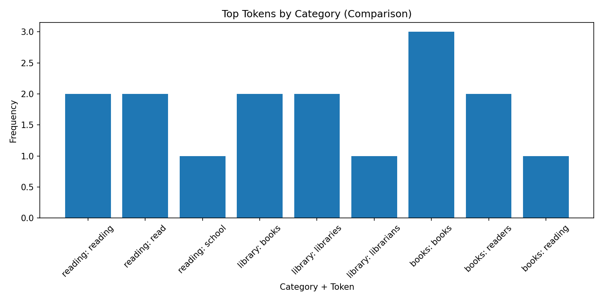

# nlp-03-text-exploration
## Author: Lindsay Foster
## Date: March 2026

[](#)
[](./LICENSE)

> Professional Python project for Web Mining and Applied NLP.

Web Mining and Applied NLP focus on retrieving, processing, and analyzing text from the web and other digital sources.
This course builds those capabilities through working projects.

In the age of generative AI, durable skills are grounded in real work:
setting up a professional environment,
reading and running code,
understanding the logic,
and pushing work to a shared repository.
Each project follows a similar structure based on professional Python projects.
These projects are **hands-on textbooks** for learning Web Mining and Applied NLP.

## This Project

This project focuses on **exploratory analysis of text data**.

The goal is to analyze a small, structured corpus and observe how
patterns emerge from token distributions, category comparisons,
and contextual relationships.

You will:

- tokenize and clean text data
- build frequency distributions
- compare token usage across categories
- examine co-occurrence (context windows)
- analyze bigrams (local structure)
- visualize results and interpret patterns

This project illustrates how **structure appears in text before any machine learning is applied**.
These patterns support later pipelines, embeddings, and retrieval.

You'll work with just these files as you update authorship and experiment:

- **notebooks/nlp_corpus_explore_case.ipynb** - notebook version
- **src/nlp/nlp_corpus_explore_case.py** - Python script
- **pyproject.toml** - project configuration and dependencies
- **zensical.toml** - project metadata

## First: Follow These Instructions

Follow the [step-by-step workflow guide](https://denisecase.github.io/pro-analytics-02/workflow-b-apply-example-project/) to complete:

1. Phase 1. **Start & Run**
2. Phase 2. **Change Authorship**
3. Phase 3. **Read & Understand**

## What to Look For

As you run the script and notebook, focus on:

- which tokens dominate each category
- how categories differ in vocabulary
- which words appear in similar contexts
- how local structure (bigrams) appears in text

These observations are the foundation for later modules.

## Success

After running the script successfully, you will see:

```shell
========================
Pipeline executed successfully!
========================
```

You will also see:

- frequency tables printed to the console
- visualizations of token distributions
- examples of co-occurrence and bigram patterns

A file named `project.log` will appear in the project folder.

## Command Reference

The commands below are used in the workflow guide above.
They are provided here for convenience.

Follow the guide for the **full instructions**.

<details>
<summary>Show command reference</summary>

### In a machine terminal (open in your `Repos` folder)

After you get a copy of this repo in your own GitHub account,
open a machine terminal in your `Repos` folder:

```shell
# Replace username with YOUR GitHub username.
git clone  https://github.com/LFoster03/nlp-03-text-exploration.git
cd nlp-03-text-exploration
code .
```

### In a VS Code terminal

```shell
uv self update
uv python pin 3.14
uv sync --extra dev --extra docs --upgrade

uvx pre-commit install
git add -A
uvx pre-commit run --all-files

# Later, we install spacy data model and
# en_core_web_sm = english, core, web, small
# It's big: spacy+data ~200+ MB w/ model installed
#           ~350–450 MB for .venv is normal for NLP
# uv run python -m spacy download en_core_web_sm

# First, run the module
# IMPORTANT: Close each figure after viewing so execution continues
uv run python -m nlp.nlp_corpus_explore_foster

# Then, open the notebook.
# IMPORTANT: Select the kernel and Run All:
# notebooks/nlp_corpus_explore_case.ipynb

uv run ruff format .
uv run ruff check . --fix
uv run zensical build

git add -A
git commit -m "update"
git push -u origin main
```
## Modification
### New Visualization: Category Comparison

A new visualization was added to compare the most frequent tokens across all categories in the corpus.

*What Changed*

Added a bar chart showing the top tokens from each category (dog, cat, car, truck).

Combined category and token labels for clearer comparison.

Expanded visualization beyond a single category.

*Why This Change Was Made*

The original script only visualized one category (dog), which limited the ability to compare vocabulary across categories. This modification allows for a clearer comparison of how language differs between groups.

*What Was Observed*

Each category shows distinct vocabulary patterns.

Animal categories (dog, cat) include behavior-related words (runs, sleeps)

Vehicle categories (car, truck) include function-related words (drives, carries)

Some overlap exists, but categories are still clearly separable

*Insights Gained*

This visualization demonstrates how text data naturally clusters by category, even with simple preprocessing. It highlights how different domains use distinct vocabularies, which is useful for tasks like classification, clustering, and topic modeling.

## Add StopWord Filtering

### Improvement: Stopword Filtering for Better Visualization

After adding the category comparison visualization, it was observed that common words like “the” dominated all categories, making the results less meaningful.

*What Changed*

Added stopword filtering to the tokenization function
Removed common words such as “the”, “and”, and “in”

*Why This Change Was Made*

Without stopword removal, the most frequent words were not meaningful for analysis. This made it difficult to compare categories effectively.

*What Was Observed*

Before: charts were dominated by common filler words
After: charts highlight meaningful, domain-specific terms

*Insights Gained*

This demonstrates that preprocessing is critical in text analysis. Small changes in data cleaning can significantly improve the quality and interpretability of results.

## Apply The Example To a Different Problem

- Copy the project.
- Use new corpus.
A custom corpus was created around the theme of books and libraries, with categories for books, libraries, and reading. Each category represents a different perspective—content, location, and activity—allowing for clear comparison of token usage.

### Corpus Exploration: Libraries & Books
*Purpose*

This module performs exploratory analysis of a small, controlled text corpus. It demonstrates how structure emerges from token distributions, category comparisons, and co-occurrence patterns before using any machine learning models.

*Corpus Categories*
**Books** – sentences about authors, readers, and types of books.
**Library** – sentences about library spaces, resources, and services.
**Reading** – sentences about reading activities, learning, and knowledge.

*Observations*

Tokens cluster by category (books, library, reading).
The books category focuses on content like authors and readers.
The library category emphasizes spaces, resources, and services.
The reading category highlights learning and activities.
Each category uses different vocabulary, showing clear topic separation.

The most frequent tokens in books included words like books and readers.
The library category emphasized terms such as libraries, books, and find.
The reading category highlighted words like reading and books.
The comparison chart of top tokens clearly shows related vocabulary across categories.

## Visualizations

### Top Tokens in Books


### Top Tokens Comparison Across Categories


</details>

## Notes

- Use the **UP ARROW** and **DOWN ARROW** in the terminal to scroll through past commands.
- Use `CTRL+f` to find (and replace) text within a file.

## Terminology

In preparation for large language models (LLM) and related methods,
our analysis does not begin with semantic interpretation.
Instead, we focus on **proximity** and observable **patterns** in the text.

We evaluate **co-occurrence (context windows)**, that is, _which words tend to appear near each other_.

The full collection of text is called a **corpus** (a set of documents).
For this analysis, each document is represented as a single line of text.

## Example Output

```text
Corpus contains 22 documents.
Tokenization complete.
shape: (10, 2)
┌──────────┬────────┐
│ category ┆ token  │
│ ---      ┆ ---    │
│ str      ┆ str    │
╞══════════╪════════╡
│ dog      ┆ dog    │
│ dog      ┆ barks  │
│ dog      ┆ loudly │
│ dog      ┆ the    │
│ dog      ┆ puppy  │
│ dog      ┆ runs   │
│ dog      ┆ the    │
│ dog      ┆ yard   │
│ dog      ┆ canine │
│ dog      ┆ wears  │
└──────────┴────────┘
Top global tokens:
shape: (10, 2)
┌────────┬─────┐
│ token  ┆ len │
│ ---    ┆ --- │
│ str    ┆ u32 │
╞════════╪═════╡
│ the    ┆ 27  │
│ near   ┆ 4   │
│ truck  ┆ 3   │
│ cat    ┆ 3   │
│ yard   ┆ 3   │
│ garage ┆ 3   │
│ dog    ┆ 3   │
│ car    ┆ 3   │
│ kitten ┆ 2   │
│ window ┆ 2   │
└────────┴─────┘
Top tokens by category:
shape: (12, 3)
┌──────────┬─────────┬─────┐
│ category ┆ token   ┆ len │
│ ---      ┆ ---     ┆ --- │
│ str      ┆ str     ┆ u32 │
╞══════════╪═════════╪═════╡
│ truck    ┆ the     ┆ 4   │
│ truck    ┆ truck   ┆ 3   │
│ truck    ┆ pickup  ┆ 1   │
│ truck    ┆ carries ┆ 1   │
│ truck    ┆ trailer ┆ 1   │
│ …        ┆ …       ┆ …   │
│ truck    ┆ heavy   ┆ 1   │
│ truck    ┆ loads   ┆ 1   │
│ truck    ┆ powers  ┆ 1   │
│ truck    ┆ cargo   ┆ 1   │
│ truck    ┆ hauls   ┆ 1   │
└──────────┴─────────┴─────┘
CAT top tokens: ['the', 'cat', 'kitten', 'window', 'near']
TRUCK top tokens: ['the', 'truck', 'pickup', 'carries', 'trailer']
CAR top tokens: ['the', 'garage', 'car', 'sedan', 'near']
DOG top tokens: ['the', 'yard', 'dog', 'across', 'ran']

Context for 'dog':
['barks', 'loudly', 'holds', 'the', 'the', 'ran', 'across']

Context for 'cat':
['sleeps', 'quietly', 'the', 'has', 'whiskers', 'the', 'slept', 'near']

Context for 'car':
['drives', 'the', 'the', 'moves', 'down', 'the', 'stopped', 'near']

Context for 'truck':
['carries', 'cargo', 'powers', 'the', 'the', 'hauls', 'heavy']
Top bigrams:
shape: (10, 2)
┌────────────┬─────┐
│ bigram     ┆ len │
│ ---        ┆ --- │
│ str        ┆ u32 │
╞════════════╪═════╡
│ near the   ┆ 4   │
│ the yard   ┆ 3   │
│ the garage ┆ 3   │
│ the cat    ┆ 2   │
│ ran across ┆ 2   │
│ the window ┆ 2   │
│ the kitten ┆ 2   │
│ the sedan  ┆ 2   │
│ slept near ┆ 2   │
│ across the ┆ 2   │
└────────────┴─────┘
```

## Text Categorization Analysis

- Which words appear **most often in each category**, and why?
- Which words tend to appear near **dog**, **cat**, or **truck**?
- What **differences** do you observe between animal-related and vehicle-related text?
- Which words seem **interchangeable** based on how they are used?
- What **patterns** help infer meaning from the data?

## General Insights

These categories are artificial and were chosen to illustrate the process.
Related approaches are used to prepare and analyze large text corpora for modern LLMs.

By examining token frequency, category differences, and co-occurrence
(which words appear near each other),
the **measurable structure of text** begins to appear.

Words used in similar contexts exhibit similar patterns,
and groups of related terms emerge naturally from the data.

Even before any modeling, we can begin to distinguish categories
and see how meaning is reflected through **patterns of use**.
